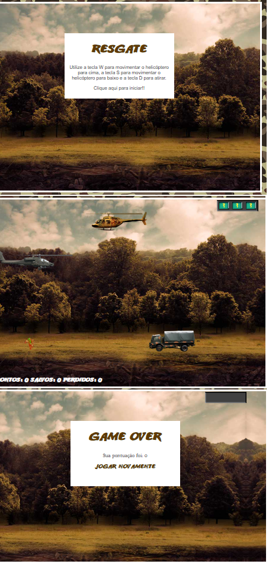

# Construindo jogo de naves

Projeto realizado com o instrutor Denilson Bonatti da Digital Innovation One.

No projeto, utilizei o VSCode como editor.

Foi utilizando o CSS3 para animação do jogo.

Usando framework JQuery collision, para as animações de colisões entre os personagens do jogo.

Para o som do jogo foi utilizado Javascript puro.

  

